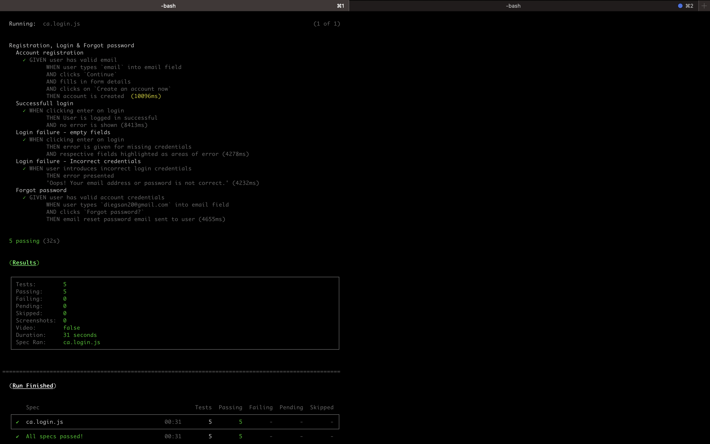

# C&A QA Task
## Table of Contents
1. [General Info](#general-info)

   -[Cypress](#cypress)
   
   -[Mailsac](#mailsac)

2. [Technologies](#technologies)
3. [Project structure](#project-structure)
4. [Installation](#installation)
5. [Email contact](#questions)

### General Info
This is a QA task for C&A login page. This includes docs for manual tests covered (tests.txt), and test themselves using [Cypress](https://www.cypress.io/) automation framework.

Please note passwords are for a test accounts created during creation of project, and normally would be used as secret key passed as environment variable via command line, to not be exposed anywhere.

I'm also leaving .env file with some credentials, but feel free to modify to different users.

## Technologies
# Cypress
Cypress docs: [Cypress docs](https://docs.cypress.io/guides/getting-started/installing-cypress) 

# Mailsac
Mailsac email api: [Mailsac](https://mailsac.com/)

`EMAIL_API_KEY` is for apikey mailsac API which will allow to call on inboxes API and assert on emails received.

Mailsac is free for sign up, and inboxes can be created with different emails and a different email api key.

Within the `before()` clause on the start of the script, mailsac will be called on whichever inbox is set as 'mailsacEmail1' env variable, and delete all emails. Then we assert that after triggering of the forgot password, we can await and assert email is received.

During creation I did test the website with different accounts but at some point I stopped receiving the emails in Mailsac. Not sure if anti-spam or security feature.

With that in mind, I've set tests up to point to a Mailsac inbox which has already an email for reset password and asserts on email received.

This inbox on `checkEmailInbox()` command, is not the same variable called on `before()` clause which deletes all emails in an inbox, so the email is there to see the flow when its called and asserted.

I shall reset said key a bit after you review entire project.

In root I've also added .mov file with recording and image of CLI results.
***

### Project-structure
     ├── cypress                   # cypress main folder.
        ├── downloads              # Downloaded file folder
        ├── fixtures               # Fixtures folders -> images, json's etc.
        ├── e2e                    # Main folder for specs. Broken down by FE, BE, + any add.
            ├── ca.login.js         
        ├── plugins                # Where tasks are added.
        └── support                # Where commands are added.
        └── utils                  # Utilities

## Installation

See below:
[Cypress Install](https://on.cypress.io/installing-cypress)

Cypress installation documents found below however, easiest way is to navigate to root of project, and install dependencies.

```
npm i
```

Once dependencies are installed, to run cypress test runner, navigate to Cypress root folder where it was downloaded/place in (/CA_task) and run command 
```
'npm run cy:open'
```

This will open the test runner from where you can run the spec for login page.

Here you will see all actions taken on UI. 

Alternatively, if you want to simply run the spec you can run.

```
'npm run cy:run:loginTest' 
```

Here, the test will run on terminal.



All start and run scripts available in 'package.json'.

## Questions

Any questions, please reach out to diegsan20@gmail.com.
